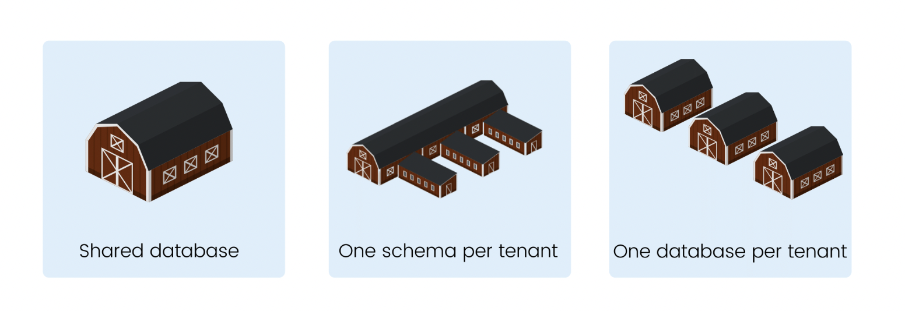
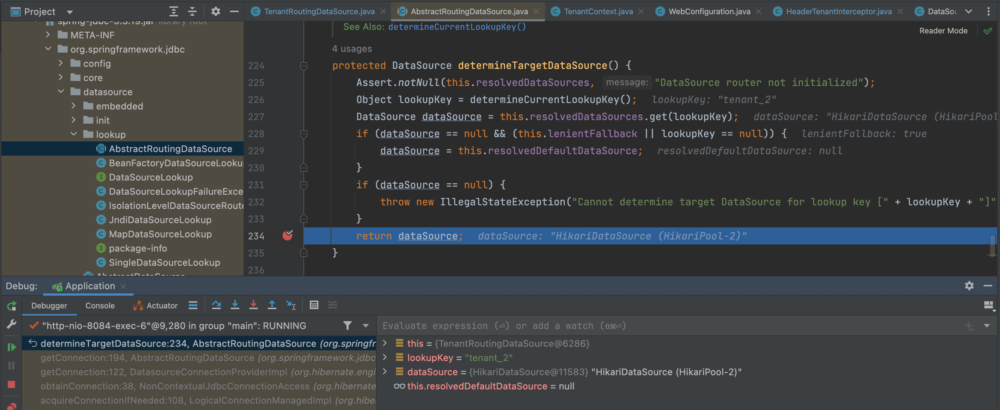

# Database-per-tenant

As the name implies, a tenant (organization) has its own database. Each time a new tenant is added to the system, a new
database is generated for the user. **Every time a new tenant is added, a new schema is generated that creates a
separate database for the tenant**. This structure facilitates customization on tenant level and proper data isolation.

The query speed of this design is relatively okay as the search path to the tenant database is set before queries are
run. Easy data backup, restoration and migration are among the benefits of this design.

While this architecture provides data isolation and speed, it does not scale so well. When the number of
tenants/clients on the app is small, this design is effective but when tenants are larger, resources compromisation is
bound to occur. The number of tables increases, the number of queries increase, so is the size of these tables. Thus,
there is a need for continued scaling of resources as more tenants are added.

## Multi-Tenant Database advantages:

- The highest level of tenant isolation and data security – data remains invisible to other users,
- Maintenance and development jobs are simplified,
- Can easily manage specific user’s data,
- No unnecessary query complexity,
- Reduced client responsibility,
- Cloud environments can scale out and scale up because tenants can be spread over multiple servers.

## Multi-Tenant Database Problems

- Potentially more servers to patch and maintain,
- As the number of tenants grows, there will be more databases being created,
- Maintain a registry of tenant-db mappings code can lead to added complexity,
- Application data shared by all tenants (i.e., dictionaries) in this type of multi-tenant system must be duplicated in
  each database or need to be extracted to another one that will be used by all tenants.

## Implementation flow

1. When the application starts, for each one of the databases a `dataSource` will be added to a map that contains all of
   them together;
2. Afterwards, for each request that the app receives, based on the `tenant_id` set in the request's header, the current
   tenant will be determined;
3. Once we know the `tenant_id`, we can determine which dataSource to use;
4. `TenantRoutingDataSource.determineCurrentLookupKey()` determines the datasource based on the `tenant_id`, because it
   overrides the `AbstractRoutingDataSource.determineCurrentLookupKey()` which selects from the map of possible
   `dataSources` the one that matches the current tenant_id, if none matches it will throw an exception. 

